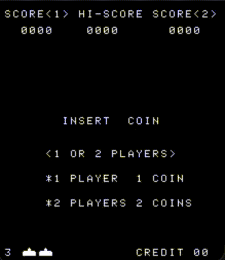

# Intel 8080 Emulator

Cycle-counting Intel 8080 emulator, with additional hardware emulation to support Space Invaders.

## Installation/Dependencies

_SDL2_

This project uses SDL2. The Makefile requires that `sdl2-config` be located on your PATH. To get it:

- **macOS (Homebrew):** `brew install sdl2`
- **Debian/Ubuntu:** `sudo apt install libsdl2-dev`
- **Fedora:** `sudo dnf install SDL2-devel`
- **Arch:** `sudo pacman -S sdl2`

To check that it's set up, run `sdl2-config --cflags --libs`. It should print compiler and linker flags, not "command not found".

_GCC_

This project's Makefile uses GCC. If you do not have it, read the installation guide [here](https://gcc.gnu.org/install/).

## Building/Running

There are two separate build targets for this project: a raw CPU emulator and the same emulator with additional hardware support for space invaders. To build them, in the project root run:

- CPU-only: `make cpu`
- Space Invaders: `make space`

The generic CPU emulator accepts test ROMs and writes to stdout. To run a test rom, in the project root run:

`./cpu <path/to/rom>`

The Space Invaders emulator loads `roms/invaders.rom` by default. This ROM is not included; see [Space Invaders ROM](#space-invaders-rom) below. To run this emulator, in the project root run:

`./space`

To load a ROM from a different path, pass it as an argument: `./space <path/to/rom>`.

Note that this project uses relative pathing, so all executables must be run from the project root.

## Space Invaders ROM

The Space Invaders ROM is copyrighted and is not included in this repository, so you'll need to supply your own copy. The CPU test ROMs are included, so `./cpu` works without it.

- If you have a single 8 KB ROM file, name it `invaders.rom` and place it in `roms/`.
- If you have the standard four-file set (`invaders.h`, `invaders.g`, `invaders.f`, `invaders.e`), place them in `roms/` and combine them from the project root:

  `cat roms/invaders.h roms/invaders.g roms/invaders.f roms/invaders.e > roms/invaders.rom`

  The order matters: `invaders.h` is loaded first, at address 0x0000.

## Playing Space Invaders

Space Invaders supports one or two players. In a two-player game, players take turns, and each player's turn ends when they lose a ship.

Controls:
- Add Credit: c
- Start 1-Player Game: o
- Start 2-Player Game: t (requires two credits)

| Action     | Player 1 | Player 2 |
|------------|----------|----------|
| Move Left  | a        | j        |
| Move Right | d        | l        |
| Shoot      | w        | i        |

## Credits

Much of the SDL setup came from [this](https://www.youtube.com/watch?v=YHkBgR6yvbY&t=3421s) YouTube video on CHIP-8 emulators, and guidance on Space Invaders hardware setup came from [here](https://pranayga.github.io/8080-emulator/).

